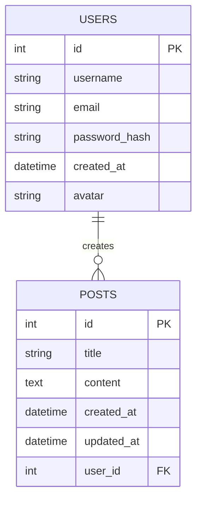

# ERD — структура базы данных

## User

| Поле          | Тип         | Описание               |
| ------------- | ----------- | ---------------------- |
| id            | Integer     | Первичный ключ         |
| username      | String(64)  | Имя пользователя       |
| email         | String(120) | Электронная почта      |
| password_hash | String(256) | Хеш пароля             |
| created_at    | DateTime    | Дата создания аккаунта |
| avatar        | String(255) | Имя файла аватара      |

## Post

| Поле       | Тип         | Описание                  |
| ---------- | ----------- | ------------------------- |
| id         | Integer     | Первичный ключ            |
| title      | String(200) | Заголовок публикации      |
| content    | Text        | Текст публикации          |
| created_at | DateTime    | Дата создания             |
| updated_at | DateTime    | Дата изменения            |
| user_id    | Integer     | Внешний ключ пользователя |

## Связь

Связь `USERS ||--o{ POSTS` означает:

**один пользователь может создать много публикаций, а каждая публикация принадлежит одному пользователю.**

Внешний ключ:

`posts.user_id → users.id`
