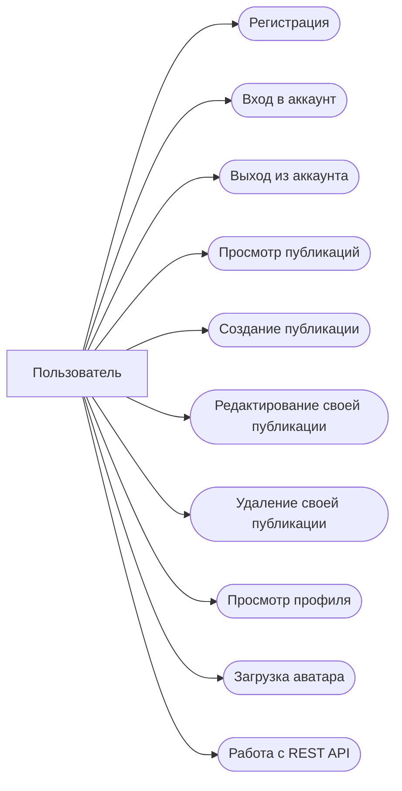

# Use Case диаграмма

## Актор

**Пользователь** — зарегистрированный или незарегистрированный посетитель веб-приложения.

## Основные сценарии

## Описание сценариев

| Use Case                  | Описание                                             |
| ------------------------- | ---------------------------------------------------- |
| Регистрация               | Создание нового пользовательского аккаунта           |
| Вход                      | Авторизация пользователя по имени или email и паролю |
| Выход                     | Завершение текущей пользовательской сессии           |
| Просмотр публикаций       | Просмотр списка публикаций на главной странице       |
| Создание публикации       | Создание новой записи с заголовком и текстом         |
| Редактирование публикации | Изменение собственной публикации                     |
| Удаление публикации       | Удаление собственной публикации                      |
| Просмотр профиля          | Просмотр профиля пользователя и его публикаций       |
| Загрузка аватара          | Изменение изображения профиля                        |
| REST API                  | Получение и изменение публикаций через API           |
